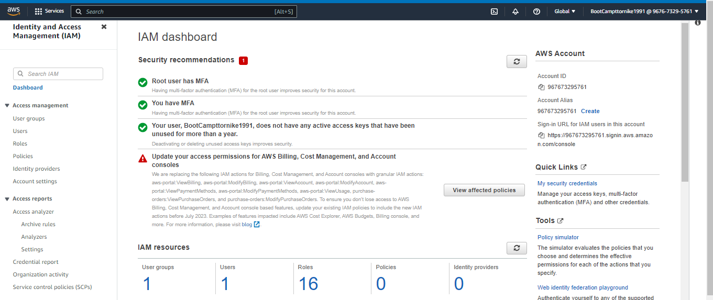
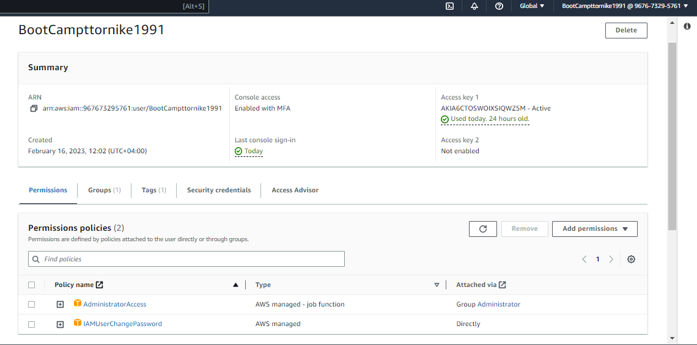
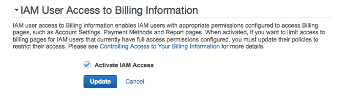
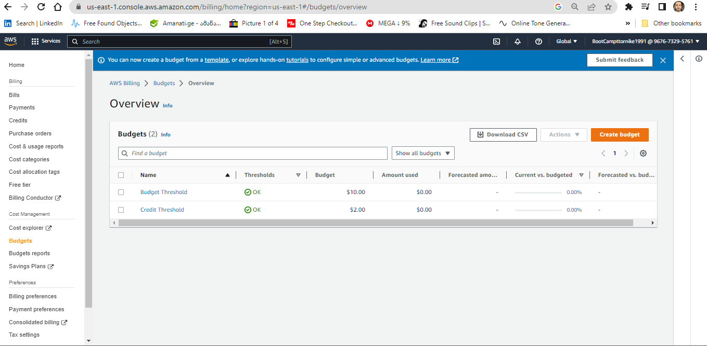
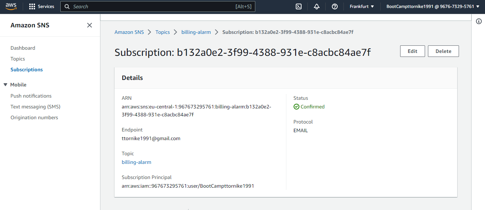
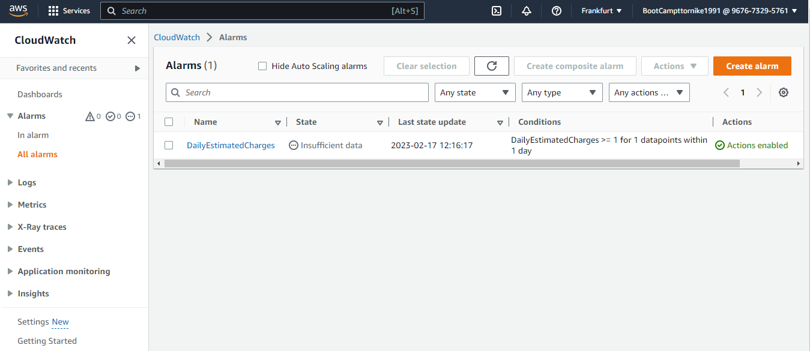
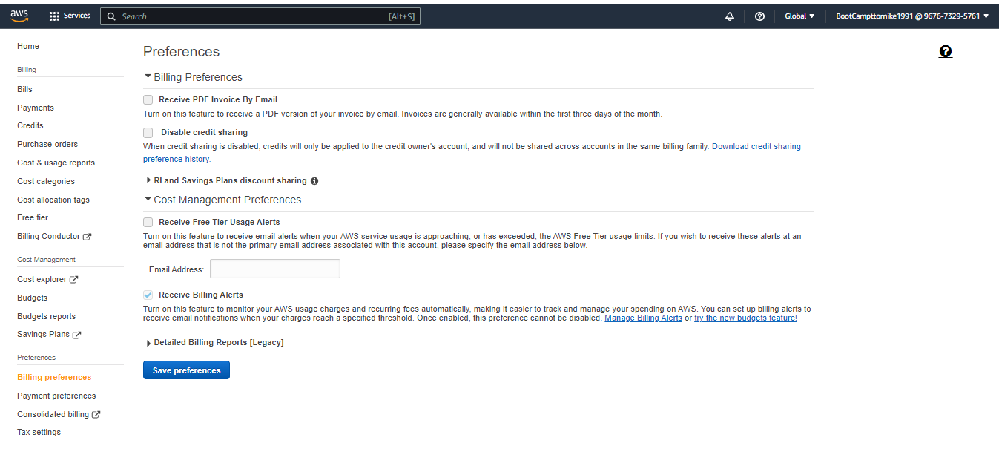
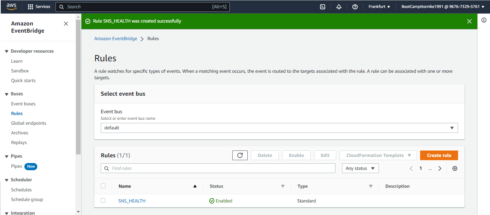

# Week 0 — Billing and Architecture

#first Task:

Setup gitpod to run aws cli installation automatically and vscode :

we have to write script in ".gitpod.yml"


<!-- script -->
```
tasks:
  - name: aws-cli
    env:
      AWS_CLI_AUTO_PROMPT: on-partial
    init: |
      cd /workspace
      curl "https://awscli.amazonaws.com/awscli-exe-linux-x86_64.zip" -o "awscliv2.zip"
      unzip awscliv2.zip
      sudo ./aws/install
      cd $THEIA_WORKSPACE_ROOT


vscode:
  extensions:
    - 42Crunch.vscode-openapi     

 ```   

 <!-- end-->

 After setup our AWS CLI we have to export some env variables to use it in our environment. Also it is important to have opened aws cloud session in browser and after that run gitpod.

<!-- this is the wariable what we need -->
we can use commnad "export" which will save variables in exact session or we can use git command "gp env" and it will save that variables in gitpod accound in specific secured location and we will have it alwasys.

 AWS_ACCESS_KEY_ID=""
 AWS_SECRET_ACCESS_KEY=""
 AWS_DEFAULT_REGION=""

TO CHECK That the aws cli session is working we can run "aws sts get-caller-identity" it must return us USER ID,ACCOUND ID and ARN (Amazon Resource Names (ARNs) uniquely identify AWS resources)


<!-- #Second Task Destroyed root account credentials, set MFA, IAM role AdministratorAccess: -->
1. We have to go to the IAM dashboard  and delete if there is any access keys for the root user and active MFA (I did it with virtual device )
2. We have to create new user 
3. We have to create new group in the user groups section and assign permission to that group. Best practice is to give minimal permission, which users need.
In my case, I gave AdministratorAccess for flexibility.
4. Also we must ativate from billing dashboard  IAM Access  to grant permissions with billings 

USER SETUP SCREENSHOT


GROUP PERMISSIONS SCREENSHOT


BILLING PERMISSIONS



<!-- end -->


<!-- Set a AWS Budget -->
Here we can find "budget.json" content which we need to setup budget from cli "notifications-with-subscribers.json" 

[AWS BUDGET CLI](https://docs.aws.amazon.com/cli/latest/reference/budgets/create-budget.html)

script to run in the Cli to create the  AWS budget

aws budgets create-budget \
    --account-id your-accound-id \
    --budget file://aws/json/budget.json \
    --notifications-with-subscribers file://aws/json/notifications-with-subscribers.json




<!-- end -->


<!-- Set SNS-TOPIC -->
We have to set Simple Notification Service (SNS topic ) for alarm 
[Create SNS Topic](https://docs.aws.amazon.com/cli/latest/userguide/cli-services-sns.html)

for that we have to run "aws sns create-topic --name <span style="color: red;">my-topic</span>" it will return  Arn


for example: 
{
    "TopicArn": "arn:aws:sns:us-west-2:123456789012:my-topic"
}

To subscribe to a topic, use the sns subscribe command.

aws sns subscribe 
    --topic-arn arn:aws:sns:us-west-2:123456789012:my-topic 
    --protocol email 
    --notification-endpoint saanvi@example.com




Set BillingAlarm(cloudwatch)




Set BilingAlerts



Eventbridge to Hookup Health Dashboard to SNS and send notification




 
