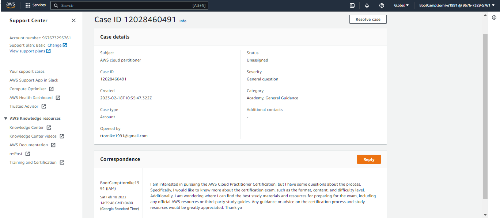
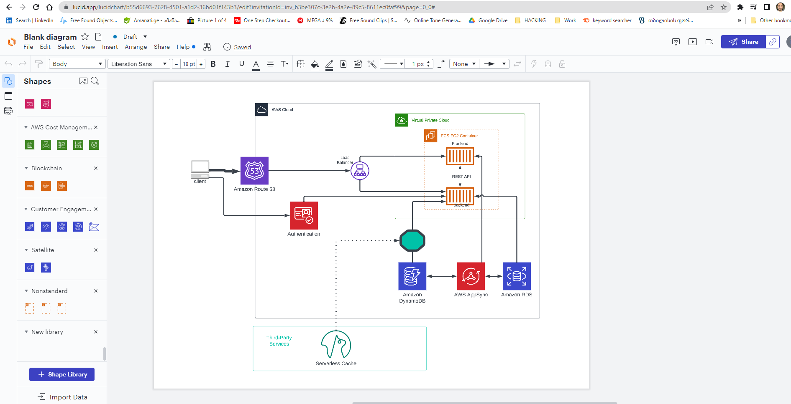
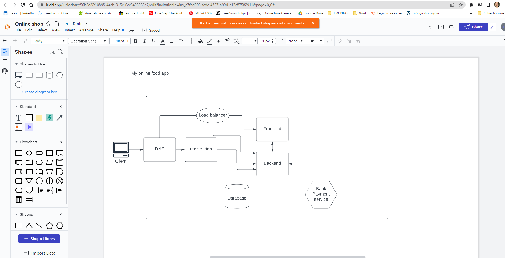
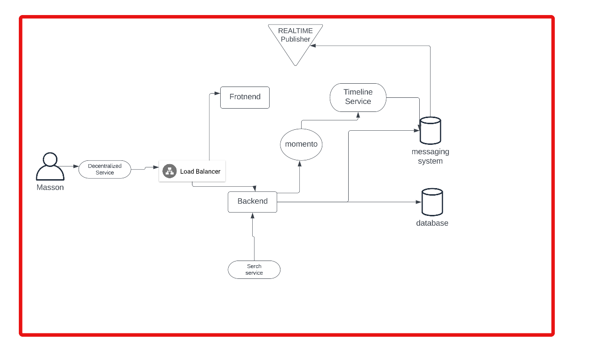

# Week 0 — Billing and Architecture
# 1
 

**Setup gitpod to run aws cli installation automatically and vscode :**

 **we have to write script in ".gitpod.yml"**


**script**
```
tasks:
  - name: aws-cli
    env:
      AWS_CLI_AUTO_PROMPT: on-partial
    init: |
      cd /workspace
      curl "https://awscli.amazonaws.com/awscli-exe-linux-x86_64.zip" -o "awscliv2.zip"
      unzip awscliv2.zip
      sudo ./aws/install
      cd $THEIA_WORKSPACE_ROOT


vscode:
  extensions:
    - 42Crunch.vscode-openapi     

 ```   

 

**after setup our AWS CLI we have to export some env variables to use it in our environment. Also it is important to have opened aws cloud session in browser and after that run gitpod.**

 


**we can use commnad "export" which will save variables in exact session or we can use git command "gp env" and it will save that variables in gitpod accound in specific secured location and we will have it alwasys.**

```
 AWS_ACCESS_KEY_ID=""
 AWS_SECRET_ACCESS_KEY=""
 AWS_DEFAULT_REGION=""
```

**TO CHECK That the aws cli session is working we can run "aws sts get-caller-identity" it must return us USER ID,ACCOUND ID and ARN (Amazon Resource Names (ARNs) uniquely identify AWS resources)**

**end**


# 2
**Destroyed root account credentials, set MFA, IAM role AdministratorAccess:**

1. We have to go to the IAM dashboard  and delete if there is any access keys for the root user and active MFA (I did it with virtual device )
2. We have to create new user 
3. We have to create new group in the user groups section and assign permission to that group. Best practice is to give minimal permission, which users need.
In my case, I gave AdministratorAccess for flexibility.
4. Also we must ativate from billing dashboard  IAM Access  to grant permissions with billings 

USER SETUP SCREENSHOT


GROUP PERMISSIONS SCREENSHOT


BILLING PERMISSIONS


**end**


# 3

**Set a AWS Budget**
**Here we can find "budget.json" content which we need to setup budget from cli "notifications-with-subscribers.json"**

[AWS BUDGET CLI](https://docs.aws.amazon.com/cli/latest/reference/budgets/create-budget.html)

**script to run in the Cli to create the  AWS budget**
```
aws budgets create-budget \
    --account-id your-accound-id \
    --budget file://aws/json/budget.json \
    --notifications-with-subscribers file://aws/json/notifications-with-subscribers.json


```


**end**


# 4

**Set SNS-TOPIC**
**We have to set Simple Notification Service (SNS topic ) for alarm**

[Create SNS Topic](https://docs.aws.amazon.com/cli/latest/userguide/cli-services-sns.html)

***for that we have to run "aws sns create-topic --name ___my-topic___" it will return  Arn***


***for example:***
```

{
    "TopicArn": "arn:aws:sns:us-west-2:123456789012:___my-topic___"
}
```
**To subscribe to a topic, use the sns subscribe command.**```
aws sns subscribe:
    --topic-arn arn:aws:sns:us-west-2:123456789012:my-topic 
    --protocol email 
    --notification-endpoint saanvi@example.com
```

**we will receive in our mail confirmation email, and we have to accept it** 


**end**

# 5

**Set BillingAlarm(cloudwatch)**
[create alarm json](https://aws.amazon.com/premiumsupport/knowledge-center/cloudwatch-estimatedcharges-alarm/)

```
aws cloudwatch put-metric-alarm --cli-input-json file://aws/json/alarm-config.json

```


**end**


# 6

**Set BilingAlerts**


***setup configuration:***
```


    aws ce put-configuration --configuration "{"SnsTopicArn":"arn:aws:sns:us-east-1:123456789012:billing-alert","Enabled":true}"

```
***Check configuration:***
```
    aws ce get-configuration

```


**end**


# 7

**Eventbridge to Hookup Health Dashboard to SNS and send notification**

***first create sns topic:***
```
aws sns create-topic --name "Health Dashboard Notifications"
```
***than Create an EventBridge rule to trigger notifications when a Health Dashboard event occurs.***
```


aws events put-rule \
--name "Health Dashboard Event Rule" \
--event-pattern '{"source": ["aws.health"], "detail-type": ["AWS Health Event"], "detail": { "service": ["SNS"], "eventTypeCategory": ["issue"], "eventTypeCode": ["AWS_SNS_TOPIC_NOT_FOUND"], "eventStatus": ["open"] } }' \
--state "ENABLED" \
--description "Rule to trigger notifications for SNS topic not found errors"

```


**end**

# 8

**Well Architected Tool**

**Reviewed all Questions**


**end**
 

 # 9
 **Research the technical and servie limits of specific servises and how they could impact the technical path for technical flexibility**


***Technical and service limits vary between different AWS services, but here are some examples of how technical and service limits could impact the technical path for technical flexibility:***

```


- Amazon EC2: One of the primary technical limits with Amazon EC2 is the number of instances that can be launched per region. For example, there may be a limit on the number of instances that can be launched in a particular availability zone or the number of instances that can be launched in a region overall. This can impact technical flexibility as it may limit the ability to scale up or down based on changing needs. Additionally, there may be limits on the amount of data that can be stored on an EC2 instance or the amount of bandwidth available for data transfer.

- Amazon S3: Amazon S3 is a highly scalable storage service, but it does have some technical limits that could impact technical flexibility. For example, there may be a limit on the number of buckets that can be created or the number of objects that can be stored in a bucket. Additionally, there may be limits on the amount of data that can be transferred out of S3 in a given month, which could impact the ability to move data between regions or to other AWS services.

- Amazon RDS: Amazon RDS is a managed relational database service, but it does have some technical limits that could impact technical flexibility. For example, there may be limits on the number of databases that can be created, the size of each database, or the number of read replicas that can be created. These limits could impact the ability to scale up or down based on changing needs or to create new databases for new applications.

- Amazon Lambda: Amazon Lambda is a serverless compute service, but it does have some technical limits that could impact technical flexibility. For example, there may be limits on the amount of memory that can be allocated to a function, the amount of time a function can run, or the number of requests that can be processed in a given period of time. These limits could impact the ability to handle sudden spikes in traffic or to run long-running processes.


```
***To ensure technical flexibility, it is important to consider these technical and service limits when designing and implementing AWS services. By understanding these limits, you can design solutions that are scalable, reliable, and cost-effective. For example, you may need to consider the use of multiple regions or the use of different AWS services to work around technical limits. Additionally, you may need to consider using auto-scaling or load balancing to ensure that your services can handle sudden changes in demand.***

**end**


**Open a support ticket and request a service limit**




**Lucidapp**
[Cruddur-Logical-Diagram](https://lucid.app/lucidchart/b55d6693-7628-4501-a1d2-36bd01f143b3/edit?viewport_loc=-201%2C-41%2C2994%2C1437%2C0_0&invitationId=inv_b3be307c-3e2b-4a2e-89c5-8611ec0faf99)



**Here is the conceptual diagram of my idea and I will sophisticate it during our bootcamp**

[Conceptual-live-diagram. My online shop idea](https://lucid.app/lucidchart/56b2a22f-0895-44cb-915c-6cc3403933e7/edit?viewport_loc=-183%2C-57%2C2219%2C1065%2C0_0&invitationId=inv_c7fed908-fcdc-4327-a99d-c13c87582911)




**What we did on livestream**

***as i understand i make video because there was writen [live-Stream]***
[Youtube-video-of-my-napkin](https://youtu.be/cMskKFnQxyo)

[Diagram-which-we-did-on-Live-session](https://lucid.app/lucidchart/4d2fdfd5-c166-4b4c-b602-65fbee246c4d/edit?shared=true&page=0_0&invitationId=inv_23b2d8e4-d0ca-4294-b5e9-7d91f2b8007c#)





**end**


