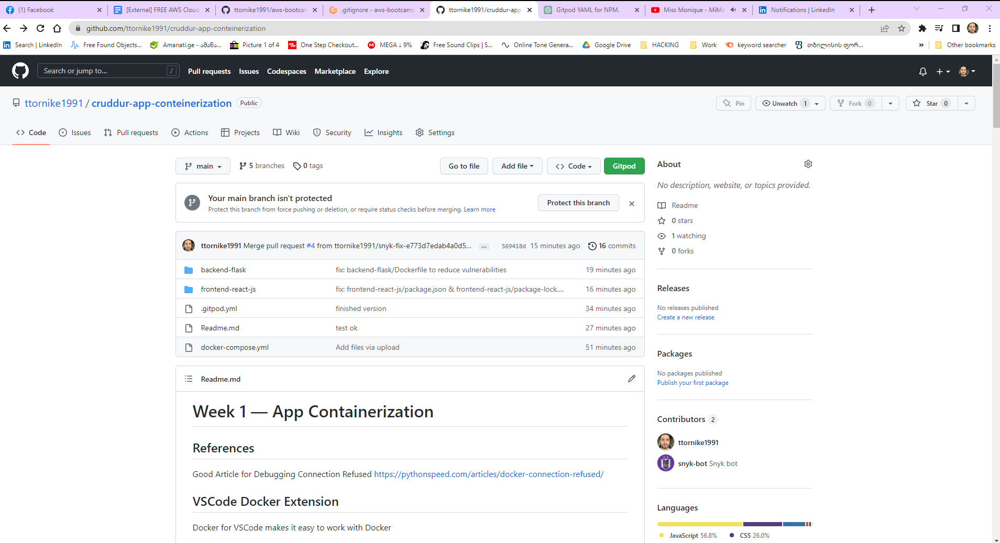
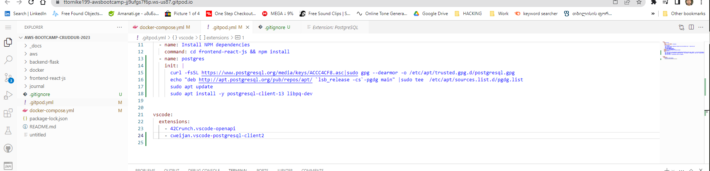
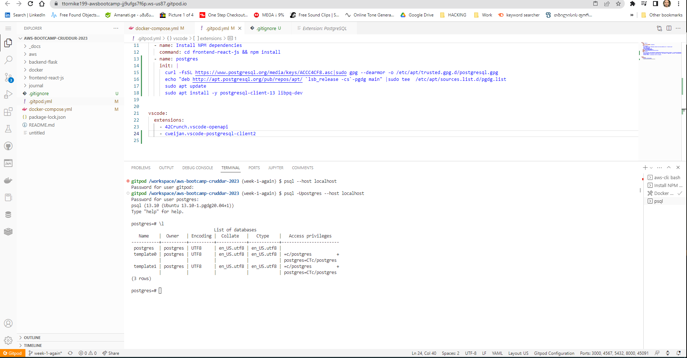
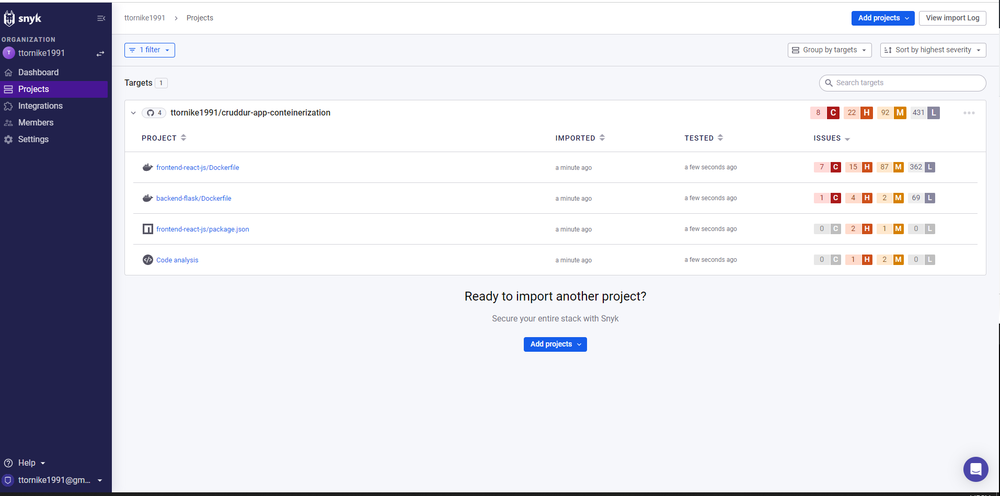
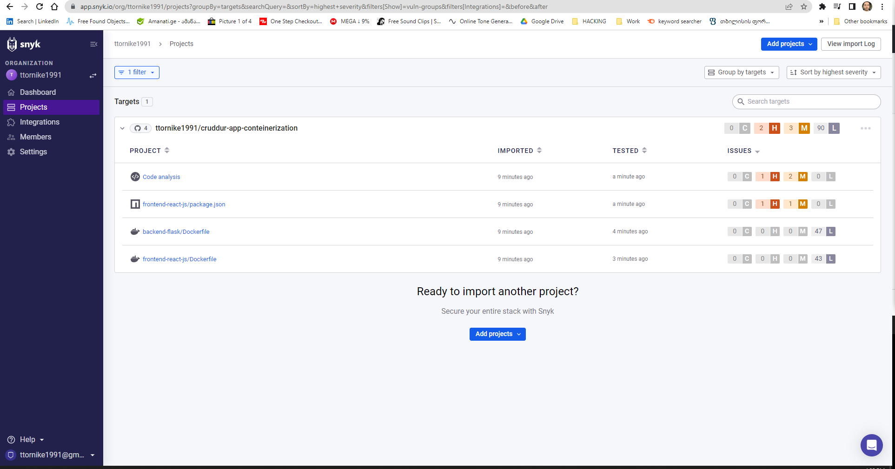

# Week 1 — App Containerization

# 1 

**Create a new GitHub repo**

I create new Repository for Application deployment. Just for containerization



**End-of-file**


# 2

**gitpod.yml config**



**End-of-file**

# 3

**ALL the Technical Tasks + scanned for vulnerabilitys via Snyk**

Setup Databases


 


SCANING




MITIGATING:





**End-of-file**


# 4 Run the dockerfile CMD  as an external script


ALSO IMPLEMENTED

- Cleaning up after the build step by removing the cache files generated during the installation of dependencies.
- Using environment variables for configuration, in this case, the FLASK_ENV and PORT.
- No additional layers were introduced to the Dockerfile to improve build times.


**Backend-flask** We have to make forexample **start.sh** into folder where is docker file:

**start.sh content:**

```
#!/bin/bash

python3 -m flask run --host=0.0.0.0 --port=4567

chmod +x start.sh
```
**Dockerfile content:**

```
# Stage 1: Build and install dependencies
FROM python:3.12.0a5-slim AS builder
WORKDIR /backend-flask
COPY requirements.txt requirements.txt
RUN pip3 install --user --no-cache-dir -r requirements.txt \
     && rm -rf /root/.cache/pip/* # clean up after the step

# Stage 2: Copy dependencies and source code
FROM python:3.12.0a5-slim
WORKDIR /backend-flask
COPY --from=builder /root/.local /usr/local
COPY . .

# Set environment variables
ENV FLASK_ENV=development
EXPOSE ${PORT}

# Create a new user and switch to that user
RUN groupadd -r myapp && useradd --no-log-init -r -g myapp myapp
RUN chown -R myapp:myapp /backend-flask
USER myapp

# Use external script start.sh
ENTRYPOINT ["/bin/bash", "./start.sh"]
```
**frontend-react-js**

We have to make forexample **npmi.sh** into folder where is docker file:  

**npmi.sh content:**
```
#!/bin/bash

npm start

chmod +x npmi.sh
```
**Dockerfile content:**
```
# Build stage
FROM node:19.6.0-bullseye-slim AS build
WORKDIR /frontend-react-js
COPY . /frontend-react-js
RUN npm install --production && npm run build \
    && rm -rf /frontend-react-js/node_modules # clean up after the step

# Production stage
FROM node:19.6.0-bullseye-slim
ENV PORT=3000
WORKDIR /frontend-react-js
COPY --from=build /frontend-react-js/build /frontend-react-js
EXPOSE $PORT
ENTRYPOINT ["/bin/bash", "./npmi.sh"]
```

**End-of-file**


# 5 Push and tag a image to DockerHub

**Check images:**
```
Docker images
```

**Tag images:**

```
docker tag homework-challenges-week-1-docker-conteinerization-full-guide-frontend-react-js:latest ttornike1991/frontend:1.0
docker tag homework-challenges-week-1-docker-conteinerization-full-guide-backend-flask:latest ttornike1991/backend:1.0
docker tag postgres:13-alpine ttornike1991/postgres:1.0
docker tag amazon/dynamodb-local:latest ttornike1991/dynamodb:1.0

```
**Push images:**
```
docker push ttornike1991/backend:1.0
docker push ttornike1991/frontend:1.0
docker push ttornike1991/dynamodb:1.0
docker push ttornike1991/postgres:1.0
```


*** I have implemented that stuff into another repository, as there was written in task to make new one. Basic containerization setup also implemented on main repo***

**End-of-file**


# 6 Use multi-stage building for a Dockerfile build  &&  Dockerfile best practise approach

**For backend use non root-user**

```
# Stage 1: Build and install dependencies
FROM python:3.12.0a5-slim AS builder
WORKDIR /backend-flask
COPY requirements.txt requirements.txt
RUN pip3 install --user --no-cache-dir -r requirements.txt

# Stage 2: Copy dependencies and source code
FROM python:3.12.0a5-slim
WORKDIR /backend-flask
COPY --from=builder /root/.local /usr/local
COPY . .

# Set environment variables
ENV FLASK_ENV=development
EXPOSE ${PORT}

# Create a new user and switch to that user
RUN groupadd -r myapp && useradd --no-log-init -r -g myapp myapp
RUN chown -R myapp:myapp /backend-flask
USER myapp

# Use external script start.sh
ENTRYPOINT ["/bin/bash", "./start.sh"]

```
**For frontend**  

I had issues while I was implementing non-root in these cases. Changing the owner for all files, including node files, took the time(like infinity). I used more configuration, but there was an issue not serving port 3000. So I left that...
```
# Build stage
FROM node:19.6.0-bullseye-slim AS build
WORKDIR /frontend-react-js
COPY . /frontend-react-js
RUN npm install && npm run build

# Production stage


FROM node:19.6.0-bullseye-slim
ENV PORT=3000
WORKDIR /frontend-react-js
COPY --from=build /frontend-react-js/build /frontend-react-js
EXPOSE ${PORT}
ENTRYPOINT ["/bin/bash", "./npmi.sh"]

```
*** I have implemented that stuff into another repository, as there was written in task to make new one.***

**End-of-file**

# 7  Implement a healthcheck in the V3 Docker compose file
```
version: "3.8"
services:
  backend-flask:
    environment:
      FRONTEND_URL: "https://3000-${GITPOD_WORKSPACE_ID}.${GITPOD_WORKSPACE_CLUSTER_HOST}"
      BACKEND_URL: "https://4567-${GITPOD_WORKSPACE_ID}.${GITPOD_WORKSPACE_CLUSTER_HOST}"
    build: ./backend-flask
    ports:
      - "4567:4567"
    volumes:
      - ./backend-flask:/backend-flask
#---------------------------------------------------------Healthcheck    
    healthcheck:
      test: ["CMD-SHELL", "curl --fail http://localhost:4567/health || exit 1"]
      interval: 30s
      timeout: 10s
      retries: 3
  frontend-react-js:
    environment:
      REACT_APP_BACKEND_URL: "https://4567-${GITPOD_WORKSPACE_ID}.${GITPOD_WORKSPACE_CLUSTER_HOST}"
    build: ./frontend-react-js
    ports:
      - "3000:3000"
    volumes:
      - ./frontend-react-js:/frontend-react-js
 #---------------------------------------------------------Healthcheck    
    healthcheck:
      test: ["CMD-SHELL", "curl --fail http://localhost:3000/health || exit 1"]
      interval: 30s
      timeout: 10s
      retries: 3
  dynamodb-local:
    user: root
    command: "-jar DynamoDBLocal.jar -sharedDb -dbPath ./data"
    image: "amazon/dynamodb-local:latest"
    container_name: dynamodb-local
    ports:
      - "8000:8000"
    volumes:
      - "./docker/dynamodb:/home/dynamodblocal/data"
    working_dir: /home/dynamodblocal
#----------------------------------------------------------------------Healthcheck    
    healthcheck:
      test: ["CMD-SHELL", "curl --fail http://localhost:8000/shell || exit 1"]
      interval: 30s
      timeout: 10s
      retries: 3
  db:
    image: postgres:13-alpine
    restart: always
    environment:
      - POSTGRES_USER=postgres
      - POSTGRES_PASSWORD=password
    ports:
      - '5432:5432'
    volumes: 
      - db:/var/lib/postgresql/data   
#---------------------------------------------------------------------------------------Healthcheck      
    healthcheck:
      test: ["CMD-SHELL", "pg_isready -h localhost -U postgres || exit 1"]
      interval: 30s
      timeout: 10s
      retries: 3

networks: 
  internal-network:
    driver: bridge
    name: cruddur
    
volumes:
  db:
    driver: local
```    
**End-of-file**

# 8  Learn how to install Docker on your localmachine and get the same containers running outside of Gitpod / Codespaces

**I get images which i pushed on docker repo, I figure out to open in browser, through localhost, frontent image.There was issue for postgres authentication error.All other images was running, but cant touch through browser. In my mind i think  there would be root container like our gitpod session, so it need Dockerfile also. I tried it but it was not working when pulling to my machine and it was 7GB, so i thought it was wrong way and deleted that part**

It will be great if there will be more video material about it.


**End-of-file**

# 9 Launch an EC2 instance that has docker installed, and pull a container to demonstrate you can run your own docker processes. 


